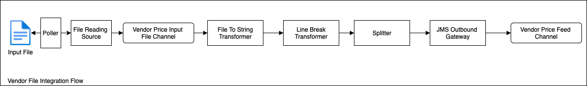
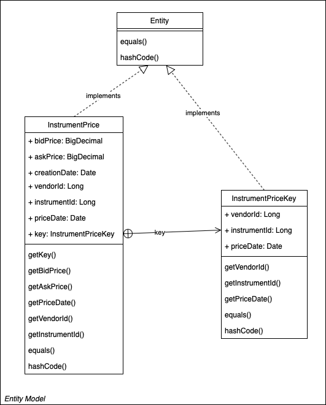

## Vendor Price Aggregator

The vendor price aggregator supports the following features:
1. Process the price updates in real time for instruments from different vendors
2. Cache the prices add store the prices in local store. Cache will have the prices for last 30 days.
3. Publish the price updates in real time to the downstream clients
4. Web services (REST API) to fetch the prices -
    * all instrument prices by vendor
    * all vendor prices by instrument

### High Level FLow:


### Integration Flows

One Pub-sub Channel per vendor - Each vendor has a designated channel for the modified price data. This way, the original price data remains intact and each application can listen to its specific vendor Message Channel for the modified price updates. The channel type is a ActiveMQ topic so that the vendor price data can be directly used by other consumers if required.

One Pub-Sub channel to publish the aggregated pries for Clients to consume. This allows the interested clients to subscribe for price updates. The channel type is a ActiveMQ topic to allow interested downstrean clients can subscribe.

#### Sequence Diagram

The vendor price updates will be processed as shown below -


#### Vendor Jms Integration Flow
This integration flow show case how to read vendor prices published in real time via a messaging channel. The solution uses Spring Integration DSL to implement to this flow.


#### Vendor File Integration Flow

This integration flow show case read vendor prices from a file and publish them as messages. The solution uses Spring Integration DSL to implement to this flow.



### Message format
The solution initially supports JSON message format for vendor and clients. The JSON format has been chosen due its lightweight format and easy to marshal and unmarshal. The solution can be extended to support other formats like XML, CSV by building transformer to process specific message format. 

Sample message
```
{"vendorId": "Vendor1", "instrumentId": "APPL", "bidPrice": 100.30, "askPrice": 101.10, "priceDate": "2020-11-21T10:20:22"}
```

### Entity Model

* Instrument Price entity consists fields - instrumentId, vendorId, bidPrice, askPrice, priceDate. 
* Composite unique key - (instrument id, vendor id, priceDate)



### Store
The solution currently uses in-memory maps stores the prices. The datastore can be switched to different type with configuration change and implementing required DAO logic.
```
app.aggregator.data-store-type=MAPDB
```

### Cache
The solution uses Ehcache to maintains a local cache of prices. The cache is configured to delete the records older than 30 days and it holds maximum of 10000 entries. If there is no feed received for in last 30 days then the system cannot provide one to a client request.
```
app.aggregator.cache-time-to-live-days=30
app.aggregator.cache-max-entries=100000
```
 
### Webservices
The solution offers REST API GET endpoints to fetch prices -
```
* GET /api/prices/vendor/{vendorId}
* GET /api/prices/instrument/{instrumentId}
```

The REST API GET services will fetch the data from cache for better performance. If any cache miss, the data will fetched from store and updates the cache.

Consumer can access the pricing API to fetch the prices as shown below:


The solution also offers a POST service which can be used to insert new instrument prices. This can be used for demo purposes.
```
POST /api/prices

[{"vendorId": "Vendor1", "instrumentId": "APPL", "bidPrice": 100.30, "askPrice": 101.10, "priceDate": "2020-11-21T10:20:22"},
{"vendorId": "Vendor1", "instrumentId": "GOOG", "bidPrice": 100.30, "askPrice": 101.10, "priceDate": "2020-11-21T10:20:22"}]
```

REST API documentation - http://localhost:8080/swagger-ui/index.html#/price-data-controller

### Technologies Used
The system is designed as a microservice using the following technologies:
* Java – versions 1.8
* Spring – including Spring boot, Spring integration, Spring Web.
* JMS – ActiveMQ
* Caching – Ehcache
* Store - in-memory map
* Testing frameworks – JUnit/Mockito
* Maven

### How to run

Run the below commands from the command line:

```
git clone https://github.com/kishorechk/vendor-price-aggregator.git 

cd vendor-price-aggregator 

./mvnw spring-boot:run
```
The command starts the Spring integration flows and REST services along with Swagger docs and UI for API documentation.

### Swagger UI

REST API documentation - http://localhost:8080/swagger-ui/index.html#/price-data-controller
